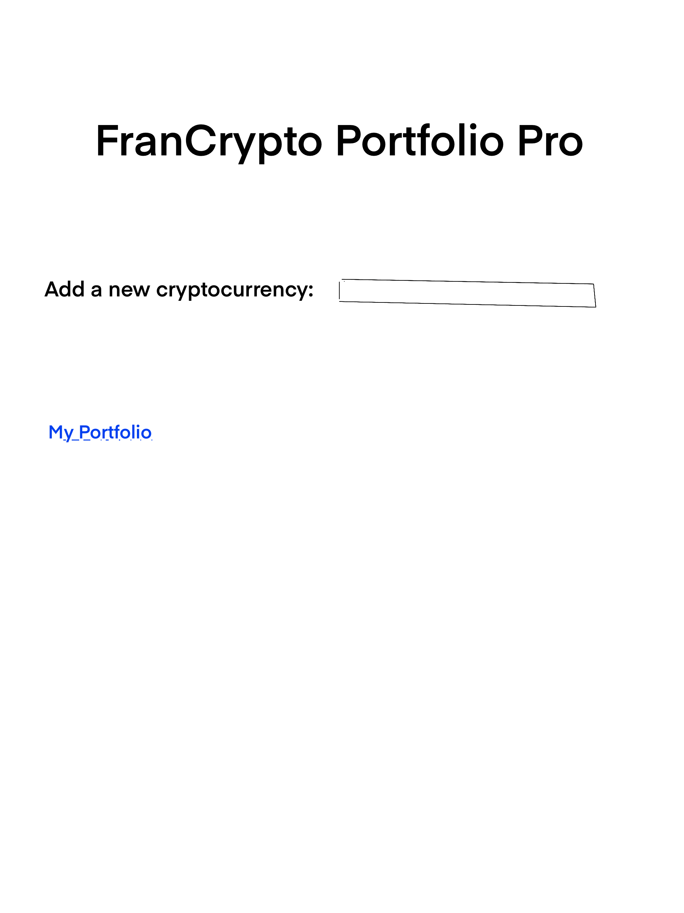
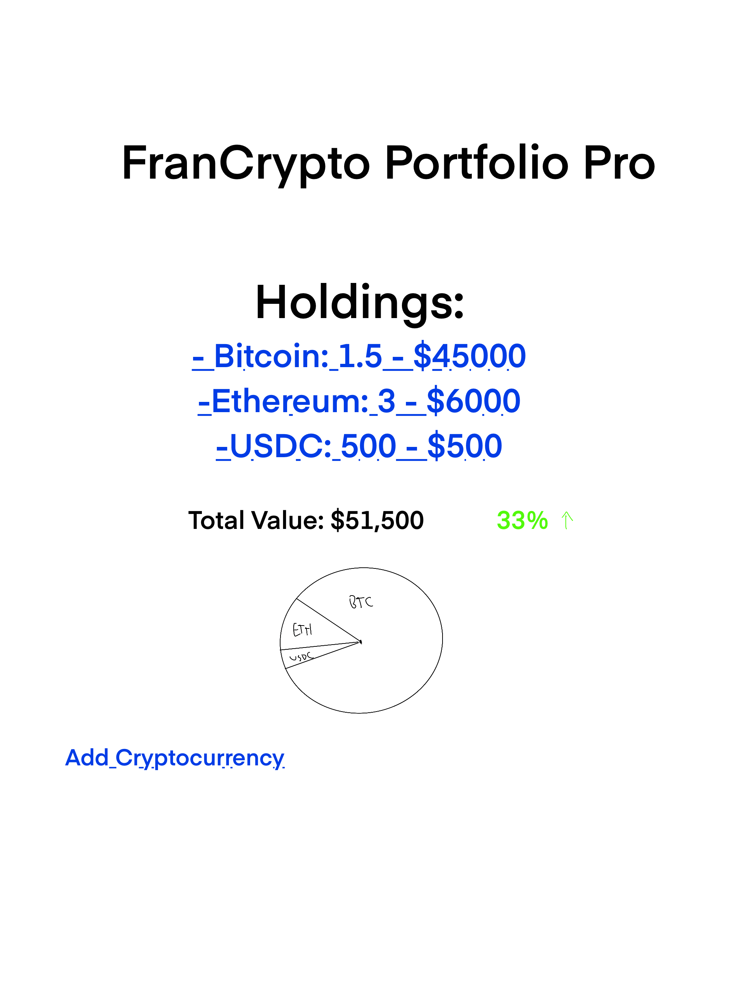
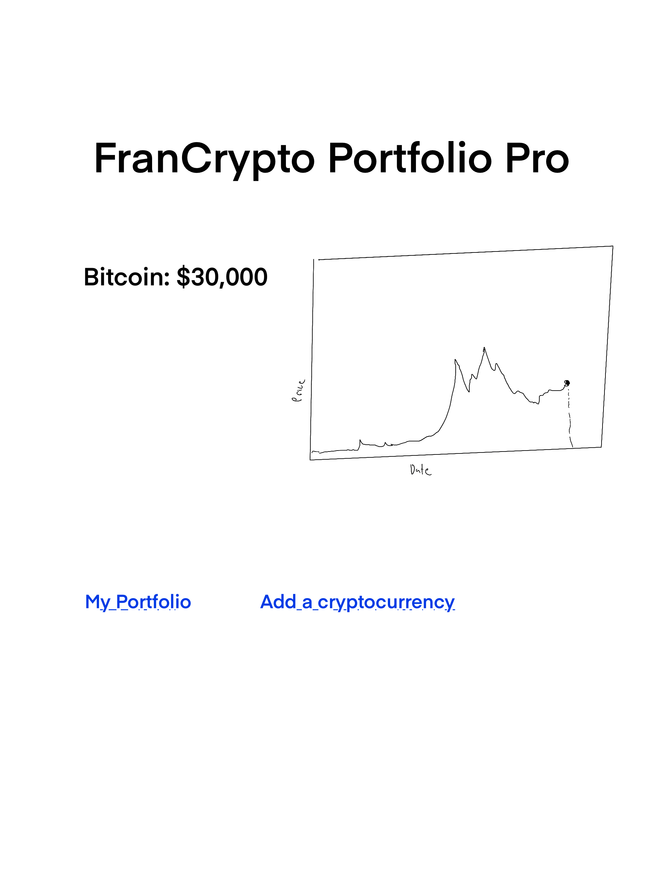
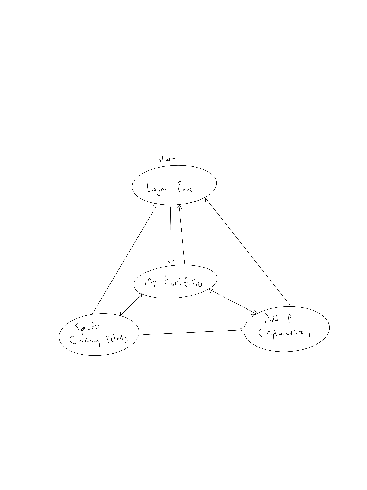

# WaterPal
NOTE: My original app idea was a cryptocurrency portfolioo tracker. I have sinced switched to a plant watering app to keep track of watering schedule.

## Overview

Keeping track of all your plants can be a difficult task especially when they all have different watering needs. Knowing when to water each individual plant at any given time can make all the difference.

WaterPal is a web app that will allow users to moonitor their plants and their watering schedules. Users can register and login. Once they're logged in, they can add their plants and modify their watering schedule. The app displays their plants and allows the user to easily keep track of when they need to be watered next


## Data Model

The application will store Users, Cryptocurrencies and Transactions

* users can have multiple transactions (via references)
* each transaction refers to a particular cryptocurrency

An Example User:

```javascript
{
  username: "cryptoinvestoor",
  hash: // a password hash,
  lists: // an array of references to Transaction documents
}
```

An Example List with Embedded Items:

```javascript
{
  user: // a reference to a User object
  cryptocurrency: "Breakfast foods",
  quantity: 1.5,
  boughtAt: 30000, // price at which the user bought this cryptocurrency
  currentPrice: // live updated price
}
```


## [Link to Commented First Draft Schema](db.mjs) 


## Wireframes

/portfolio/create - page for adding a new cryptocurrency to the portfolio



/portfolio - page for showing all cryptocurrency holdings



/list/slug - page for showing specific cryptocurrency details and historical performance



## Site map



## User Stories or Use Cases

1. as non-registered user, I can register a new account with the site
2. as a user, I can log in to the site
3. as a user, I can add a cryptocurrency holding
4. as a user, I can view all of my cryptocurrency holdings
5. as a user, I can view the current value and/or the performance of each holding
6. as a user, I can remove or edit a cryptocurrency holding

## Research Topics

* (5 points) Integrate user authentication
    * I'm going to be using passport for user authentication
* (3 points) Real-time data fetch for cryptocurrency priices
    * Will use a third party API such as coinmarketcap or CoinGecko to get real-time price updates.
* (2 points)
    * Use a library such as Chart.js to visually represent portfolio performance over time.

10 points total out of 8 required points 


## [Link to Initial Main Project File](app.mjs) 

## Annotations / References Used

1. [passport.js authentication docs](http://passportjs.org/docs) - Used for user authentication in the app
2. [CoinGecko API docs](https://www.coingecko.com/api/documentation) - Used for fetching real-time cryptocurrency data
3. [Chart.js docs](https://www.chartjs.org/docs/latest/) - For creating visual data representations

